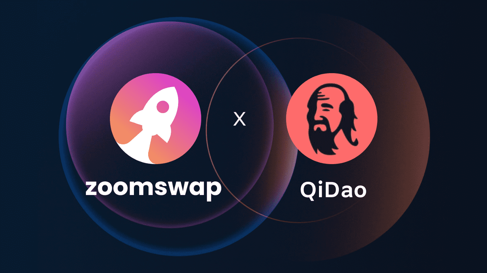

# ZoomSwap V2

ZoomSwap 是一个跨链基础设施项目，为第一层区块链、AMM 和合作项目建立流动性。在 IoTeX 上推出，农民有一个令人兴奋的机会来赚取 $ZM 和其他项目代币。
ZoomSwap 受益于 IoTeX 上快速且廉价的交易功能。
我们相信我们仍处于加密的早期阶段。我们仍在探索太空中的新行星。
去，放大，探索！

Zoomswap 正在 IoTeX 上推出，该区块链具有快速和廉价的交易。对于农民来说，这是一个赚取 $ZOOM 和其他项目代币的激动人心的机会。

