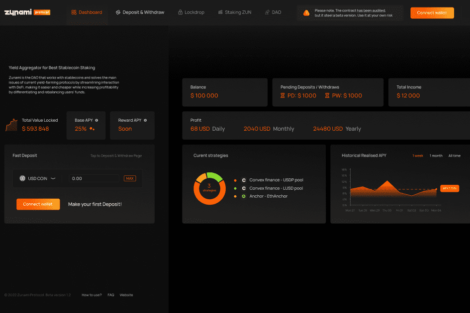

# Zunami Protocol

Zunami 是与稳定币合作的 DAO，它通过简化与 DeFi 的交互来解决当前收益农业协议的主要问题，使其更容易、更便宜，同时通过区分和重新平衡用户资金来提高盈利能力。

Zunami ---一个defi Dapp，简化了 DeFi 的交互成本，解放双手去参与defi。最有特色的我觉得是比直接通过 Curve-Convex 使用更少的Gas费，Zunami 协议交互成本是直接交互的1/4。它会自动卖出收益然后再投资，不断的复利。DAO 确定了最赚钱的策略，允许持有者在其 Tether (USDT)、Dai (DAI) 或美元硬币 (USDC) 稳定币上赚取更高的利率。

简单来说就是存u，zunami自动帮你找到最佳的defi产品，收益继续复利，如果有更好的defi，就自动切换继续复利。

